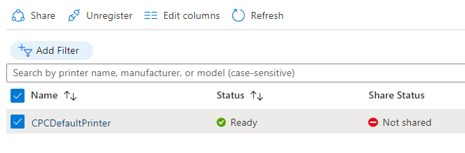
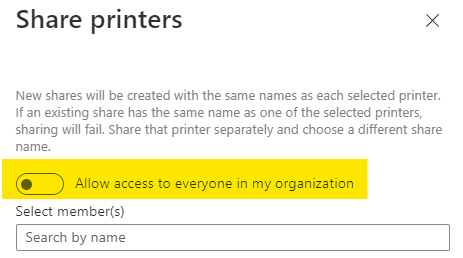

# Lab B: Deploy and manage Windows 365 Enterprise Cloud PCs
***
In this Lab you will learn how to deploy a Windows 365 Enterprise Cloud PC. For that you need a user with appropriate licenses and also some additional components in an Azure subscription. An Azure Active Directory Connect service with hybrid device join feature will be configured. All of the resources simulating an on-prem environment will be created in Azure.

Content:

1. Task - [Check Azure Subscription](#1-task---check-azure-subscription)
2. Task - [Create the simulated on-premise environment](#2-task---create-the-simulated-on-premise-environment)
3. Task - [Configure Azure Active Directory Connect and Device settings](#3-task---configure-azure-active-directory-connect-and-device-settings)
4. Task - [Enable Universal Printing](#4-task---enable-universal-printing)
5. Task - [Prepare a Windows 365 Custom Image](#5-task---prepare-a-windows-365-custom-image)
6. Task - [Create a Windows 365 Azure network connection](#6-task---create-a-windows-365-azure-network-connection)
7. Task - [Create Windows 365 User Settings](#7-task---create-windows-365-user-settings)
8. Task - [Create a Windows 365 Provisioning policy](#8-task---create-a-windows-365-provisioning-policy)
9. Task - [Assign User to AAD Group](#9-task---assign-user-to-aad-group)
10. Task - [Connect to the Cloud PC](#10-task---connect-to-the-cloud-pc)
11. Task - [Remote Management](#11-task---remote-management)
***

### 1. Task - Check Azure Subscription
>**Note**: Your already created an Azure AD tenant in Lab A. Now your trainer guides you through the process of creating an Azure Resource subscription to create some resources for this lab. You will use for this lab the same global admin account as you used in Lab A.
      
<!--
>+ Use https://www.microsoftazurepass.com/ to use the Azure Pass Code.
-->
   
### 2. Task - Create the simulated on-premise environment
   1. In the [Azure portal](https://portal.azure.com), open **Cloud Shell** pane by selecting on the toolbar icon directly to the right of the search textbox.
   2. If prompted to select either Bash or PowerShell, select **PowerShell**.
      >**Note:** If this is the first time you are starting Cloud Shell and you are presented with the You have no storage mounted message, select the subscription you are using in this lab, and select Create storage.
   3. To create a resource group, type the following command and press Enter:
         ```powershell
         $location = 'eastus';
         $rgname = 'RG-W365Env';
         New-AzResourceGroup -Name $rgname -Location $location;
         ```
   4. To create a virtual network, type the following command and press Enter:
         ```powershell
         New-AzVirtualNetwork -Name 'VNet-Hub' -ResourceGroupName $rgname -Location $location -AddressPrefix '10.100.0.0/16';
         $vnet = Get-AzVirtualNetwork -Name 'VNet-Hub' -ResourceGroupName $rgname;
         Add-AzVirtualNetworkSubnetConfig -VirtualNetwork $vnet -Name 'sn-CloudPCs' -AddressPrefix '10.100.10.0/24';
         Add-AzVirtualNetworkSubnetConfig -VirtualNetwork $vnet -Name 'sn-OnPremSim' -AddressPrefix '10.100.20.0/24';
         Set-AzVirtualNetwork -VirtualNetwork $vnet;
         ```
   5. To create a VM acting as domain controller, type the following and press Enter:
         ```powershell
         $cred = New-Object -TypeName PSCredential -ArgumentList ('localadmin',(ConvertTo-SecureString 'Pa$$w0rd1234' -AsPlainText -Force));
         New-AzVM -ResourceGroupName $rgname -Location $location -Name opDC -VirtualNetworkName $VNet.Name -SubnetName 'sn-OnPremSim' -Credential $cred -Size 'Standard_D2as_v5' -PublicIpAddressName 'opDC-PupIP' -Image 'Win2019Datacenter' -OpenPorts @(3389,5986);
         ```
      >**Note**: If the VM chosen size does not allow you to create a VM search with the following command for an available size in your subscription and location:
      >`az vm list-skus --location westeurope --size Standard_D --output table`

      >**Note**: At the moment of writing this guide, a lot of VM sizes were not available and the Az.Compute had a bug. Since that it could be the command above would leads to an error. In this case use the following step to create a VM manually.

   6. *This step is only necessary if you should see error messages in Cloud Shell.* Create a VM manually:
      | Setting            | Value                                             |
      | ------------------ | ------------------------------------------------- |
      | VM Name            | opDC                                              |
      | Region/Location    | West Europe                                       |
      | Image              | [smalldisk] Windows Server 2019 Datacenter - Gen1 |
      | Size               | Standard_D2as_v5 or available size                |
      | Username           | localadmin                                        |
      | Password           | Pa$$w0rd1234                                      |
      | Inbound Port Rules | RDP (3389)                                        |
      | Licensing          | use an existing Windows Server license yes        |
      | *Disks*            |
      | OS disk type       | Standard SSD                                      |
      | *Networking*       |
      | Virtual Network    | VNet-Hub                                          |
      | Subnet             | sn-OnPremSim                                      |
      | Public IP          | Create new                                        |
    
   7. After the VM is created successfully, select it and click 'Networking' in the resource menu.
   8. Next to **Network Interface:** click the name of the NIC 'opDC'.
   9. In the resource menu under *Settings* click the item 'IP configurations' and in the list click the line 'opDC - IPv4 - Primary - ...'
   10. Under *'**Private** IP address settings'* set the assignment to 'Static' and type the IP address: '10.100.20.100'.
   11. Click 'Save' and wait until the deployment has finished.
   12. Navigate to the resource group 'RG-W365Env' and click the vnet 'VNet-Hub'.
   13. In the resource menu under **Settings** select 'DNS servers' and set the IP Address '10.100.20.100' for a custom DNS server. Click 'Save'.
   14. Navigate to your VM 'opDC' and connect to it via RDP.
   
### 3. Task - Configure Azure Active Directory Connect and Device settings
   1.  Sign In as localadmin with the password Pa$$w0rd1234.
   2.  Open a PowerShell Console as administrator and type the following commands:
         ```powershell
         Install-WindowsFeature -Name AD-Domain-Services -IncludeAllSubFeature -IncludeManagementTools;
         Install-ADDSForest -DomainName localAD.com -DomainNetbiosName localAD -SafeModeAdministratorPassword (ConvertTo-SecureString -String 'Pa$$w0rd1234' -AsPlainText -Force ) -InstallDns -Force;
         ```
   3. Wait until the VM restarted.
   4. Connect to the VM again and sign in again as localadmin. 
   5. Use the administrative tool 'Active Directory Domains and Trust' to add a domain suffix. This suffix must be your tenants primary domain.
   6. Use the tool 'Active Directory Users and Computers' and create an organizatinal Unit named 'W365Users'.
   7. Create three users in the newly create OU:
         | Name             | UPN                         | Password |
         | ---------------- | --------------------------- | -------- |
         | Salvo Montalbano | salvo@\<yourPrimaryDomain>  | Pa$$w0rd |
         | Phryne Fisher    | phryne@\<yourPrimaryDomain> | Pa$$w0rd |
         | Mike Hammer      | mike@\<yourPrimaryDomain>   | Pa$$w0rd |

   8. Open a PowerShell console and install chocolatey:
         ```powershell
         Set-ExecutionPolicy Bypass -Force;
         Invoke-Expression ((New-Object System.Net.WebClient).DownloadString('https://chocolatey.org/install.ps1'));
         ```  
   1.  Install Microsoft Edge Browser:
         ```powershell
         choco install microsoft-edge -y;
         ```  
   10. Download Azure Active Directory Connect from [download center](https://www.microsoft.com/en-us/download/details.aspx?id=47594) and install the tool with the following settings:
      
         | Setting                        | Value                                           |
         | ------------------------------ | ----------------------------------------------- |
         | Use custom settings            | yes                                             |
         | Install required components    | Accexpt defaults and click Install              |
         | User Sign-in                   | Password Hash Sync, Enable Single Sign On       |
         | Connect to Azure AD            | use your Azure Admin                            |
         | Select your Directory          | use your local Admin (localadmin, Pa$$w0rd1234) |
         | Azure AD sign-in configuration | Check 'Continue without matching ...'           |
         | Domain and OU filtering        | Select Computers and OU W365Users               |
         | Optional features              | Select 'Password writeback'                     |
         | Enable single sign-on          | reenter your local Admin credentials            |
         >**Hint:** Alternativley follow the [visual instructions](./media/AADConnectConfig.md#visual-instructions-for-azure-active-directory-connect).
   11. Wait for the installation and the synchronization succeeded successfully. (Check the users in Azure Active Directory)
   12. Open the 'Azure AD Connect' tool and click the button 'Configure'.
   13. Then select the item 'Configure device options' and click twice 'Next'.
   14. In the window 'Connect to Azure AD' provide the credentials of your AAD admin.
   15. Select 'Configure Hybrid Azure AD join' and click 'Next'.
   16. Select 'Windows 10 or later domain-joined devices' and click 'Next'.
   17. Select the checkbox next to 'localAD.com'. As Authentication Service select 'Azure Active Directory' and click the button 'Add' to sign in as enterprise administrator to the local AD. Use 'localad\localadmin' and Pa$$w0rd1234 as password.
   
       > **Hint:** Alternativley follow the [visual instructions](./media/HybridAADJoin.md#visual-instructions-for-hybrid-azure-ad-join)
   18. Finish the wizard and stay connected to the DC and proceed with the next task.

### 4. Task - Enable Universal Printing
1. Open a PowerShell console and create a printer with the following commands.
      ```powershell
      $portName = 'TCPPort:10.100.20.200';
      $printerDriverName ='MS Publisher Color Printer';
      Add-PrinterPort -Name $portName -PrinterHostAddress '10.100.20.200';
      Add-Printer -Name 'CPCDefaultPrinter' -PortName $portName -DriverName $printerDriverName;
      ```
2. Download the UP Connector from [here](https://aka.ms/UPConnector). The link and further information could be found in the [documentation](https://docs.microsoft.com/en-us/universal-print/fundamentals/universal-print-connector-installation).
3. Start the downloaded file (UniversalPrintConnectorInstaller.*.exe) and sign in to your tenant as global admin.
4. After the login use 'CPCPrinterConnector' as connector name and click the button 'Register'.
5. Wait until the connector is registered.
6. In the windows 'Universal Print Connector' in the list 'Available Printers' select the recently installed printer 'CPSDefaultPrinter' and click 'Register'.
7. After the registration close the window and switch to a Microsoft Edge browser.
8. Navigate to the [Azure portal](https://portal.azure.com) and sign in as global admin if required.
9. In the search text box type 'Universal Print' and click the found item or use that [link](https://portal.azure.com/#blade/Universal_Print/MainMenuBlade/Overview).
10. In the resource menu under **'Manage'** select the item 'Printers' and check if the 'CPCDefaultPrinter' could be found in the list.
11. Select the printer (use the checkbox next to the printer name) and then click the button 'Share' in the command bar.

12. Select 'Allow Access to everyone in my organization' or select at least the users Phryne Fisher and Sherlock Holmes.

13. Click 'Share Printer' to save the configuration.

>**Note:** You have now configured a virtual on-premises infrastructur, enabled hybrid identities with Azure AD Hybrid Join and enabled Universal Print.
   
### 5. Task - Prepare a Windows 365 Custom Image
   1. Switch to your browser on your workstation/notebook.
   2. Open a browser and navigate to the [Azure portal]('https://portal.azure.com') and sign in with your global administator credentials, if not already done.
   3. Search for Azure Active Directory and create a security group:
         | Setting         | Value               |
         | --------------- | ------------------- |
         | Group type      | Security            |
         | Group name      | W365EnterpriseUsers |
         | Membership type | Assigned            |
         | Members         | Mike Hammer         |
   4. To create a custom image for Cloud PCs you could create a VM in Azure or upload your own on-premises prepared image. The following steps show you how to create an image of an Azure VM. Create a new Azure VM in your subscription with the following command in cloud shell:
         ```powershell
         Invoke-WebRequest -Uri 'https://github.com/distcode/w365ws/raw/main/Labfiles/OnPremWin10Sim.json' -OutFile .\OnPremWin10Sim.json;
         New-AzResourceGroupDeployment -ResourceGroupName RG-W365Env -TemplateFile ./OnPremWin10Sim.json -ShutdownNotificationMail 'admin@<yourPrimaryDomain>';
         ```
   19. After the VM is created successfully connect to it via RDP. The username is 'localadmin' and the password is 'Pa$$w0rd1234'.
   20. Select 'No' for all privacy settings and click the button 'Accept'.
   21. Open a PowerShell console and prepare the VM for chocolatey:
         ```powershell
         Set-ExecutionPolicy Bypass -Force;
         Invoke-Expression ((New-Object System.Net.WebClient).DownloadString('https://chocolatey.org/install.ps1'));
         ```
   22. In the same console install Adobe Reader, Chrome Browser and 7zip:
         ```powershell
         choco install adobereader -y;
         choco install googlechrome -y;
         choco install 7zip -y;
         ```
   23. To verify the installation open the Start menu and search for the entries of the three products.
   24. Switch back to the PowerShell console and type the following command:
         ```powershell
         C:\Windows\System32\Sysprep\sysprep.exe /generalize /oobe /shutdown
         ```
         >**Note:** Since the VM shuts down after sysprep has finished, you will be disconnected. Do not start the VM again.
   25. Switch back to your browser and navigate - if not already done - in the [Azure Portal](https://portal.azure.com) to your VM.
   26. Click the button 'Capture' in the 'Overview' pane of the VM to create the image.
   27. Provide the following settings and click 'Review + create':
         | Setting                              | Value                                      |
         | ------------------------------------ | ------------------------------------------ |
         | Resource Group                       | RG-W365Env                                 |
         | Share image to Azure compute gallery | Select 'No, capture only a managed image.' |
         | Name                                 | cpcCustomWindows10                         |
   28. After the validation click the button 'Create' and wait for the deployment has finished.
   29. If not already done, open a further tab in your browser and navigate to the [Endpoint Manager admin center](https://endpoint.microsoft.com).
   30. In the navigation menu click 'Devices' and then select the menu item 'Windows 365' in the resource menu section 'Provisioning'.
   31. In the command bar click 'Custom images' and '+ Add'.
   32. In the 'Add image' pane provide the following settings and then click the button 'Add':
         | Setting       | Value                   |
         | ------------- | ----------------------- |
         | Image name    | W10Ent Company Standard |
         | Image version | 1.0.0                   |
         | Source Image  | cpcCustomWindows10      |
   33. You could proceed with the next task, while the image is uploading. But you could check the upload progress in the column 'Status'.
         >**Note:** You added a custom image for your cloud PCs which will be used via with a Provisioning policy later.

### 6. Task - Create a Windows 365 Azure network connection
   1. In the browser tab of your [Endpoint Manager admin center]('https://endpoint.microsoft.com') click in the command bar 'Azure network connection'.
   2. Click '+ Create' and then 'Hybrid Azure AD Join'.
   3. Provide the following settings and wait until the network is created successfully:
         | Setting             | Value                  |
         | ------------------- | ---------------------- |
         | Name                | Hybrid Join Network    |
         | Subscription        | *your subscription*    |
         | Resource Group      | RG-W365Env             |
         | Virtual network     | VNet-Hub               |
         | Subnet              | sn-CloudPCs            |
         | AD DNS domain name  | localAD.com            |
         | Organizational Unit | W365Users              |
         | AD username UPN     | localadmin@localad.com |
         | AD domain password  | Pa$$w0rd1234           |
      >**Note:** You created a connection from the Windows 365 service to your on premises environment. In real you have to create a VPN Gateway connection between your on premises network and the Azure virtual network. In that case ensure you could resolve DNS names for local resources in Azure.
      >**Note:** This connection will be used in a Provisioning policy later.
   4. You could proceed with the next task, while the network connection will be created.
   
### 7. Task - Create Windows 365 User Settings
   1. Next, you will create a User settings configuration. To do so, click in the command bar on 'User settings' and the button '+ Add'.
   2. Provide the following settings:
         | Setting                                 | Value                  |
         | --------------------------------------- | ---------------------- |
         | Name                                    | Standard User Settings |
         | Enable Local admin                      | yes                    |
         | Allow users to initiate restore service | yes                    |
         | Frequency of restore-point service      | 12 hours               |
   3. Assign these settings to the group *W365EnterpriseUsers*.
   4. Click 'Next' and then 'Create'.
      >**Note:** These settings are applied automatically to users which are members of the group *W365Enterpriseusers* and have a Windows 365 Enterprise license assigned. 

### 8. Task - Create a Windows 365 Provisioning policy
   >**Note:** Before you can proceed with the next steps you have to ensure that the network connection deployment has finished (Status must be *Checks successful*). In a real environment, also the custom image from task 4 should be uploaded completly (Status must be *Upload successful*). But in this guide a gallery image will be used. 
   1. Select 'Provisioning policies' and then click '+ Creat Policy'.
   2.  Use the following settings to create the Provisioning policy:
         | Setting           | Value                                                                                                           |
         | ----------------- | --------------------------------------------------------------------------------------------------------------- |
         | Name              | Hybrid Join Policy                                                                                              |
         | Join type         | Hybrid Azure AD Join                                                                                            |
         | Network           | Hybrid Join Network                                                                                             |
         | Image type        | Custom image ^(1)^; click 'Select' and choose *W10Ent Company Standard* |
         | Language & Region | English (United States)                                                                                         |
         | Assignment        | Click '+ Add groups' to add the group *W365EnterpriseUsers*.                                                    |
         >**Note:** You created a provisioning policy to control how the cloud pcs are deployed. You selected the hybrid join option which requires an Azure AD Connect plus Device Settings configuration.

         >^(1)^ Shouldn't the selected image work, select here the custom image  *Windows 10 Enterprise + OS Optimizations, 21H2, 1vCPI/2GB/64GB*.
   
### 9. Task - Assign User to AAD Group
   1. Navigate in a new browser tab to the [Microsoft Admin Center](https://admin.microsoft.com). If needed sign with your global admin account.
   2. Search for the User *Phryne Fisher* and assign her the a *Windows 365 Enterprise 1 vCPU, 2GB, 64 GB* license.
   3. Select the tab 'Account' and add her to the group *W365EnterpriseUsers*.
   4. Switch to the tab with the [Endpoint Manager admin center])(https://endpoint.microsoft.com) and click 'All Cloud PCs' in the command bar of 'Devices | Windows 365'.
   You should see here soon a device with the name starting with *SPS-phryne-*. Wait until the status is set to 'Provisioned' to proceed with the next tasks.
      >**Note:** This could take more than 30 minutes.
      >**Note:** You could add more users to the AAD group. But only those with a valid license can use the cloup pc.
   
### 10. Task - Connect to the Cloud PC
   
In this task you will see how to connect to a cloud pc with your browser but also with the Remote Desktop App.

   1. First, open a new in-private/incognito windows of your browser.
   2. Navigate to [Windows 365](https://windows365.microsoft.com) and sign in as *phryne@\<yourPublicDomain>*; use the password *Pa$$w0rd*.
   3. Click the button 'Next' until it changes to 'Get started'. Press it once more and you should see 'Welcome, Phryne Fisher'.
   4. Under the text 'Your Cloud PCs' you find a tile for your cloud pc. Click the crop to check all possible settings, but do not click any.
   5. Instead, click the button 'Open in browser'.
   6. A new tab is created and you have to click 'Connect'.
      >**Note:** Before that you could select the local resources which should be available inside your cloud pc session.
   7. Provide the password (Pa$$w0rd) again and click 'Sign In'.
   8. Open a PowerShell console and tpye the following command to check if the cloud PC is joined to local domain and to Azure Active Directory:
		```powershell
		dsregcmd.exe /status
		```
		In the section 'Device State', the values *AzureADJoined* and *DomainJoined* should be set to 'Yes'.
   9. Open Windows settings from start menu and add the CPCDefaultPrinter. It should be found because of Universal Print.
   10. Search in the Start menu for the pre-installed apps: Adobe Reader, Goolge Chrome and 7zip.
   10. Open the start menu again and click the power off button to disconnect from the Cloud PC.
   11. If needed, select the tab 'Windows 365' in the same browser window.
   11. Click 'Download Remote Desktop' and chose the option for you operating system.
   13. Install the app and start it from your start menu.
   14. In the Remote Desktop app click the button 'Subscribe' and sign with the username *'*phryne@\<yourPublicDomain>* and the password *Pa$$w0rd*.
   15. After you signed in successfully you should see an icon for your cloud pc.
   16. Double-click it and sign in.
         >**Note:** You are connected to the same cloud pc as before.
   17. Stay connected and proceed with the next task.

### 11. Task - Remote Management
1. Switch to your browser and the tab with [Endpoint Manager admin center](https://endpoint.microsoft.com).
2. If needed click 'Devices' in the navigation menue, 'Windows 365' in Section **Provistioning** and then click 'All Cloud PCs' in the command bar.
3. Click the name of the Cloud PC.
4. In the command bar click 'Collect diagnostics' and then confirm with 'Yes'.
5. Click 'Restart' in the command bar and confirm with 'Yes'.
6. While you have to wait until all diagnostic data are collected and uploade (see the area 'Device actions status'), proceed with the next step.
7. The button 'New remote assistance session' is disabled. To enable that feature, click 'Tenant administration' in the navigation menu and afterwards 'Remote help' in the upcoming resource menu.
8. Under settings enable remote help and click 'Save'.
9.  Navigate back to your cloud device and check, if the button 'New remote assistance session' is now enabled. 
      >**Note:** To use that feature, you have to assign an additional license to your users. If time permitts, start a free trial for the license 'Remote Help Add On', assign it to phryne@\<yourPublicDomain> and install the app 'Remote Help' in the cloud PC. At the time of writing the guide, this feature is still in preview. For further information see the [Microsoft documentation](https://docs.microsoft.com/en-us/mem/intune/remote-actions/remote-help) and this [Endpoint Manager blog article.](https://techcommunity.microsoft.com/t5/microsoft-endpoint-manager-blog/remote-help-a-new-remote-assistance-tool-from-microsoft/ba-p/2822622)
10. An already existing and well working App is 'Quick Assist'. On your local workstation/notebook open it from the Start menu to give assistance and on the Cloud PC open it to get assistance. You have to sign in to a Microsoft or Work account on your local machine. You will get a code which is available for 10 minutes. This code must be used in Cloud PC' app. 
11. In the Endpoint Manager portal, in the resource menu section **Monitor** of your cloud PC/Device click 'Device diagnostics' to check the state of the diagnostics collection.
12. After the action completes, click 'Download' in the row for the action and confirm with 'Yes'.
    >**Note:** [In the Microsoft documentation](https://docs.microsoft.com/en-us/mem/intune/remote-actions/collect-diagnostics) could you see which and how the data are collected. This is important to understand the content of the downloaded zip file.
    >**Note:** Should the collection of diagnostic data takes longer than 20 minutes, restart the Cloud PC to initiate the process. Do not forget to inform the user.


