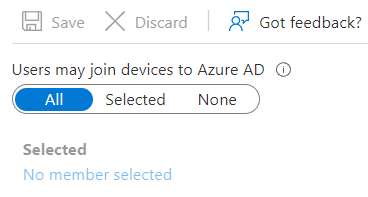
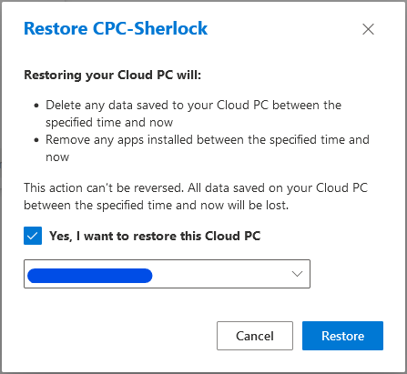
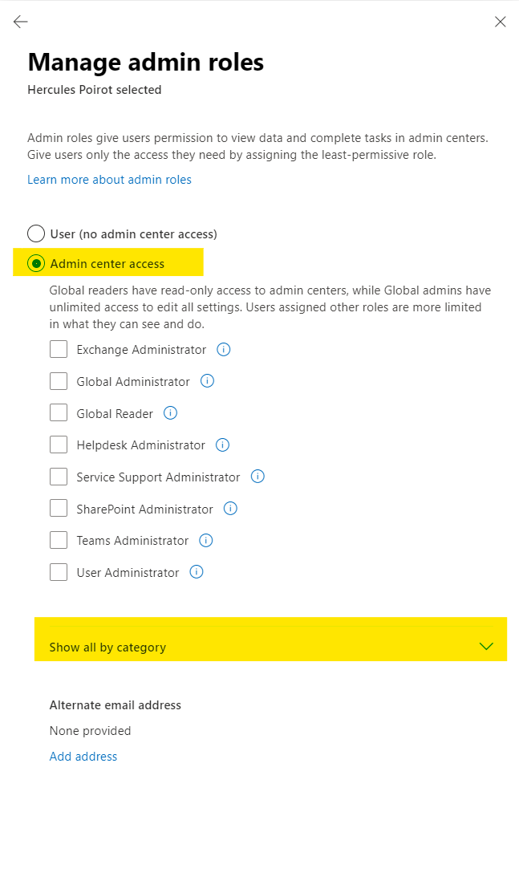
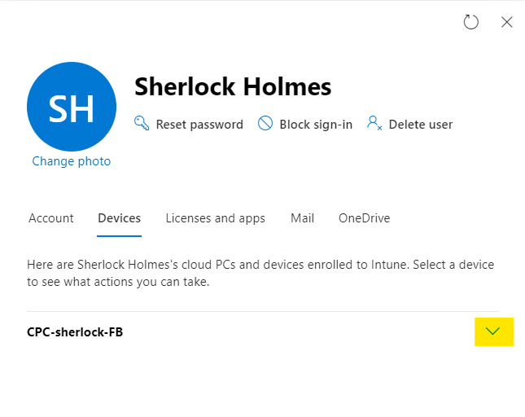

# 1. Lab A: Deploy Windows 365 Business Cloud PCs

***
In this lab you will learn how to deploy and use a Windows 365 Business Cloud PC. For this lab it is not necessary to have an Azure Active Directory Connect service in place. With that service you can onyl assign a Cloud PC to a cloud identity. With the AAD Connect service you could assign that licenses also to hybrid identities, as you will see in Lab B.

Content of the lab:

  1. Task - [Activate Trial Subscription](#1-task---activate-trial-subscription)
  2. Task - [Create a user in Azure AD](#2-task---create-a-user-in-azure-ad)
  3. Task - [Update organization settings](#3-task---update-organization-settings)
  4. Task - [Assign the Windows 365 Business License](#4-task---assign-the-windows-365-business-license)
  5. Task - [Connect user to a cloud PC](#5-task---connect-user-to-a-cloud-pc)
  6. Task - [Remote Management](#6-task--remote-management)
***

### 1. Task - Activate Trial Subscription
   >**Note**: Your trainer guides you through the process.
   <!---
   >+ create an Azure Active Directory tenant; Start with a M365 E5 Trial
   >+ create a Globa Administrator account
   >+ add licences (Microsoft 365 E5, only buy licenses, no assignment!!!)
   --->

### 2. Task - Create a user in Azure AD
1. Navigate to the [Microsoft Admin center](https://admin.microsoft.com).
2. To sign in, use your global admin account.
3. In the navigation menu select 'Users' and the 'Active Users'.
4. Click in the command bar '+ Add a user' and create a user with the following settings:
   | Setting                                        | Value                        |
   | ---------------------------------------------- | ---------------------------- |
   | First name                                     | Sherlock                     |
   | last name                                      | Holmes                       |
   | Username                                       | sherlock@\<yourPublicDomain> |
   | Automatically create a password                | No                           |
   | Password                                       | Pa$$w0rd1234                 |
   | Require this user to change their password ... | No                           |
   | Send password in email upon completion         | yes                          |
   | Email the new password ...                     | your global admin            |
   Click 'Next'.
5. Set the location to Austria and assign only the 'Nicrosoft 365 E5' license without any additionl settings.
6. Click 'Next'.
7. On the page 'Optional settings click 'Next'. 
8. Review the information for your new user and click 'Finish and adding'.
9. Click 'Close' to return to the list of your Azure AD users.
10. Create a second user, which will be configured as Windows 365 administrator later. Repeat steps 3 throu 9 with the following settings:
   | Setting                                        | Value                        |
   | ---------------------------------------------- | ---------------------------- |
   | First name                                     | Hercules                     |
   | last name                                      | Poirot                       |
   | Username                                       | hercules@\<yourPublicDomain> |
   | Automatically create a password                | No                           |
   | Password                                       | Pa$$w0rd1234                 |
   | Require this user to change their password ... | No                           |
   | Send password in email upon completion         | yes                          |
   | Email the new password ...                     | your global admin            |
   Click 'Next'.
11. Now you should check, if users are allowed to join devices to Azure Active Directory. To do so, navigate to the [Azure Active Directory portal](https://portal.azure.com/#blade/Microsoft_AAD_IAM/ActiveDirectoryMenuBlade/Overview). This [link](https://aad.portal.azure.com) would also work.
12. Click in the resource menu in the section **Manage** the item 'Devices'.
13. Click in the new resource menu 'Device settings' and check the configuration 'Users my join devices to Azure AD'. This must be set to 'All'.

      >**Note:** In a real envrionment you could select also a group of users to avoid granting everybody the permissin to join devices. But in the picture you see the default for new tenants.
14. Proceed with the next task to set up a Cloud PC.

### 3. Task - Update organization settings
1. In the middle of the page, click 'Update organization settings'.
2. In the left fly-out select 'Local administrator'. This makes the user of a cloud PC to an administrator.
3. To choose the operation system for the cloud PCs select here 'Windows 11'.
4. Click 'Save' and close the fly-out.

### 4. Task - Assign the Windows 365 Business License
To set up a cloup PC for Windows 365 *Business* you have to assign a license. Although it is possible to assign this license in Microsoft Admin center, this guid will show you how to do that in the Windows 365 portal.
1. Open an new tab in your browser and navigate to the [Windows 365 portal](https://windows365.microsoft.com).
2. If needed sign in with your global admin account.
3. Select the user 'Sherlock Holmes' and click in the left fly-out on 'Licenses and apps'.
4. Select 'Windows 365 Business 1 vCPU, 2 GB, 64 GB' and then click the button 'Save changes' at the bottom.
5. Close the fly-out to return to the list of your users.
   >**Note:** A user with the name *Windows 365 BPRT Permanent User* is created automatically in Azure Active Directory. ***Do not change or delete that user***, otherwise your Cloud PCs would not work.

   >**Note:** The provisioning process will take about 30 minutes. In case of running for a longer time, re-assign the license to the user. To see the progress of the process, proceed with the next task.


### 5. Task - Connect user to a cloud PC
In this task you will see how to connect to a cloud pc with your browser but also with the Remote Desktop App.
1. Open a new in-private/incognito windows of your browser.
2. Navigate to [Windows 365](https://windows365.microsoft.com) and sign in as *sherlock@\<yourPublicDomain>*; use the password *Pa$$w0rd1234*.
3. Should you see the welcome wizard, click the button 'Next' until it changes to 'Get started'. Press it once more and you should see 'Welcome, Sherlock Holmes'.
4. Under the text 'Your Cloud PCs' you find a tile for your cloud PC.
5. Click the button 'Open in browser'.
6. A new tab is created. Deselct all local resources (Printer, Microphone and Clipboard). Then click 'Connect'.
7. Provide the password *Pa$$w0rd1234' and click 'Sign In'. After a few moments you are connected to Windows 11 desktop.
8. In the toolbar, upper left corner, your username and Cloud PC configuration is mentioned.
9. In the toolbar, upper right corner, you could set the window to the full screen.
   
   
10. Open the crop menu to investigate the sections.
11. Click the section 'In session' and select 'Clipboard'.
12.  Click the button 'Update' and re-sign in to the Cloud PC.  some session settings. To get to your users profile page, click the last icon.
13. Start 'Microsoft Store' app and install the following software: 'Microsoft To Do: Lists, Tasks and Reminders'. It is not necessary to sign in to Microsoft Store. Ensure the sucsessfull installation by starting it from the Start menu.
14. Open a PowerShell console and tpye the following command to check if the cloud PC is joined to local domain and to Azure Active Directory:
      ```powershell
      dsregcmd.exe /status
      ```
      In the section 'Device State', the value *AzureADJoined* should be set to 'Yes'. It is not possible to join a Windws 365 Business to your local AD.
15. Open the start menu again and click the power off button to disconnect from the Cloud PC.
16. If needed, close the current tab and return to the tab 'Windows 365' in the same browser window.
17. Click 'Download Remote Desktop' and chose the option for you operating system.
      >**Note:** On this page you find also a link for the subscription URL. This URL could be used to establish a connection to a Cloud PC instead of an Azure AD Account name.
18. Install the app and start it from your start menu.
19. In the Remote Desktop app click the button 'Subscribe' and sign with the username *'*sherlock@\<yourPublicDomain>* and the password *Pa$$w0rd*.
20. After you signed in successfully you should see an icon for your cloud pc.
21. Double-click it and sing in as *'*sherlock@\<yourPublicDomain>* again.
      >**Note:** You are connected to the *same* Cloud PC as before. You should see the installed Microsoft To Do app in Start menu.
22. Sign out and switch back to your in-private/incognito browser window.

23. In the tile of your Cloud PC locate the crop to start the Remote Management.
    | Menu item          | Function                                                                          |
    | ------------------ | --------------------------------------------------------------------------------- |
    | Restart            | Restart of the Cloud PC                                                           |
    | Reset              | Reinstall Cloud PC. Apps, end user files and changes of settings would be removed |
    | Restore            | Restore to a past restore point                                                   |
    | Rename             | Rename the Cloud PC in the Windows 365 portal                                     |
    | Troubleshoot       | Review of the Cloud PC's connectivity                                             |
    | System Information | Get some information of the Cloud PC                                              |
24. Click the item 'Rename' and provide the new name `CPC-Sherlock`.
25. Click the item 'Troubleshoot' and start the troubleshooting process to find any problems preventing a connection.
    >**Note:** This should be finished after a few moments if there are not any problems.
26. Click the item 'Restore'. Select a restore point.
    
    >**Note:** The first short-term restore point is created 12 hours after the creation of the Cloud PC. Therefore a restore is not possible. For more information about short and long term restore points see the [Microsoft documentation](https://docs.microsoft.com/en-us/windows-365/business/restore-overview#restore-point-intervals).
27. Click 'Cancel' to close the window.
>**Note:** These remote management features could be used by users. The next steps will show you how to do that as administrator.

### 6. Task - Remote Management
You will see in this task how to grant administrative permissions for Windows 365 to a user and in which portals remote management features are offered.
1. Switch to the normal browser and sign in, if necessary, as global administrator to the [Microsoft Admin center](https://admin.microsoft.com).
2. Click 'Active User' in the navigatin menu.
3. Select 'Hercule Poirot' and then click 'Manage roles' in the rigth fly-out.
4. Select 'Admin center access' and then open the section 'Show all by category'.
   
   
5. In the category select 'Devices' select 'Windows 365 Administrator'.
6. Click 'Save changes' and close the fly-out.
      >**Note:** A Windows 365 Administrator is allowed to do the following:
      >- Manage Windows 365 Cloud PCs in Microsoft Endpoint Manager
      >- Enroll and manage devices in Azure AD, including assigning users and policies
      >- Create and manage security groups, but not role-assignable groups
      >- View basic properties in the Microsoft 365 admin center
      >- Read usage reports in the Microsoft 365 admin center
      >- Create and manage support tickets in Azure AD and the Microsoft 365 admin center
7. Select 'Sherlock Holmes' in the list of active users to see properties in the fly-out.
8. Select 'Devices'.
9. If not already open, select the device you would like to manage.
. 
10. Investigate the buttons in the fly-out. In addition to the features explained in step 23 of the last task, it is possible to change the account type.
11. To set a user as 'Standard user' or 'Local Administrator', click 'Change account type'.
12. Click 'Cancel' as the type shouldn't be changed.
13. A second opportunity to do remote management is to use the Windows 365 portal.
14. Open a new browser tab and navigate to this [portal](https://windows365.microsoft.com). Be sure to be signed in as global administrator. If not click on the user icon in the upper right corner and sign out.
15. In the list of 'Your organization's Cloud PCs' select 'Sherlock Holmes'.
16. In the fly-out click 'Devices'.
    >**Note:** In this blade you could do the same as you learned in step 10 of this task.
